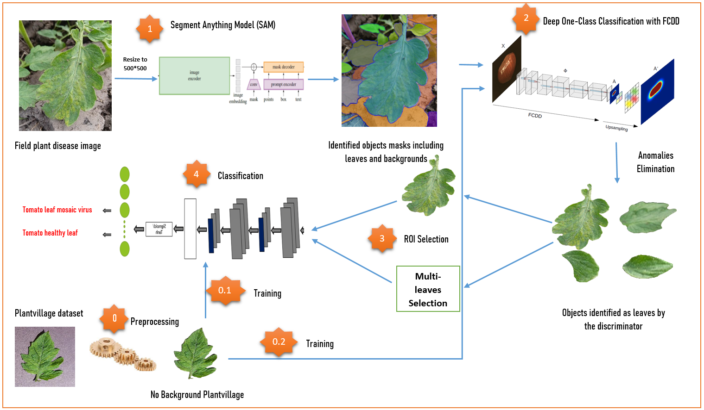

# Field_Plant_Disease_Detection
Researchers have designed various CNN trained on public or private datasets for plant disease detection to help farmers remedy crop yield losses on their farms because of plant diseases. Plant village is a publicly available and the most widely used plant disease dataset because it contains 54,309 laboratory images across 14 crop species and 38 plant disease classes. Laboratory images were captured under controlled conditions in laboratories with a single leaf on each image and a uniform background. Models trained on such datasets have very low accuracies when running on field images captured directly in plantations with various interwoven leaves, complex backgrounds, and different lighting conditions. Furthermore, existing studies in this area have not focused on multi-disease identification using a single-field plant image. In this study, we propose a model ensemble solution for the accurate identification and classification of plant diseases on field images. The model uses Segment Anything Model to efficiently circumscribe all identifiable objects in the image, and Image Processing techniques are used to isolate the identified object from the original image. To differentiate identified background objects from actual leaf objects, we used a Fully Convolutional Data Description, an explainable deep one-class classification model for anomaly detection. Finally, the selected Region of interest is submitted to a Plantvillage-trained classification model for inference. Our model can detect multiple diseases appearing on different leaves of the same image and improves validation accuracies by 15\% on public field plant disease datasets such as PlantDoc, thus providing a reliable solution for farmers and practitioners.

# Table of Contents

- [Introduction](#introduction)
- [Features](#features)
- [Installation](#installation)
- [Usage](#usage)
- [Contributing](#contributing)
- [License](#license)

## Introduction

Explain what your project does and what problem it solves. Provide context for its use.

## Features

Highlight key features of your project. Use bullet points for easy readability.

- Feature 1
- Feature 2
- ...

## Installation

Provide instructions on how to install and set up your project. Include any dependencies that need to be installed.

```bash
# Example installation command
npm install your-package


```markdown

